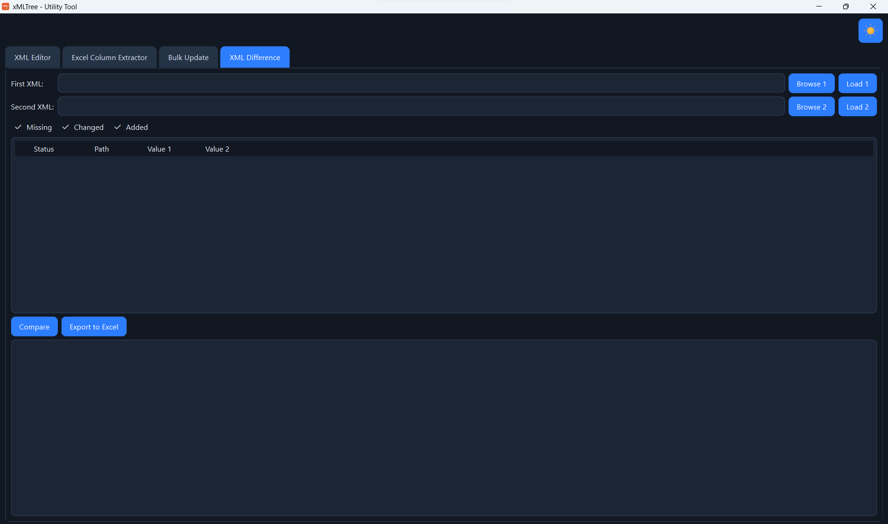

# xMLTree – XML Tree Editor  
**Fast, beautiful, searchable XML editor for huge device configuration files**  


This is a lightweight XML editor that supports easy tree view edit option.

### Features
- Full tree view of any XML file  
- Search by attribute name (e.g. type `LocalId` → finds `X_2C7AF4_LocalId`, `{any}LocalId`, etc.)  
- Case-insensitive & substring matching  
- Double-click any node to edit tag, text, or attributes  
- Add / delete nodes  
- Works flawlessly with namespaced XML  
- Single executable (no Python needed)
- Path Search
- Copy child




### Download (Latest Version)

**For Ubuntu / Debian / Linux Mint / Pop!_OS / any modern Linux**

Go to the latest release:  
https://github.com/ehitimum/xMLTree/releases/latest

Download these two files:
- `xMLTree-linux` ← the program  
- `xMLTree-linux.png` ← the icon (optional, for menu integration)

### Install & Run (30 seconds)

```bash
# 1. Make it executable (only once)
chmod +x ~/Downloads/xMLTree-linux

# 2. Run it
~/Downloads/xMLTree-linux
```

Double-clicking the file also works after the first `chmod`.

### Optional: Add to Applications Menu (so it appears when you press Super key)

```bash
# Run these commands once:
mkdir -p ~/.local/bin ~/.local/share/applications ~/.local/share/icons/hicolor/512x512/apps

cp ~/Downloads/xMLTree-linux ~/.local/bin/xMLTree
cp ~/Downloads/xMLTree-linux.png ~/.local/share/icons/hicolor/512x512/apps/xMLTree.png

cat > ~/.local/share/applications/xMLTree.desktop <<EOF
[Desktop Entry]
Name=xMLTree – XML Editor
Comment=Tree-based XML editor with powerful search
Exec=$HOME/.local/bin/xMLTree
Icon=xMLTree
Terminal=false
Type=Application
Categories=Development;Utility;
EOF
```

Now press the Super (Windows) key → type “xMLTree” → launch with one click and beautiful icon!

### Automatic Releases
Every new version is built and released automatically using GitHub Actions.  
Just download from the link above – always the latest!

### Author
Ehitimum 
https://github.com/ehitimum

Enjoy editing XML the easy way!

